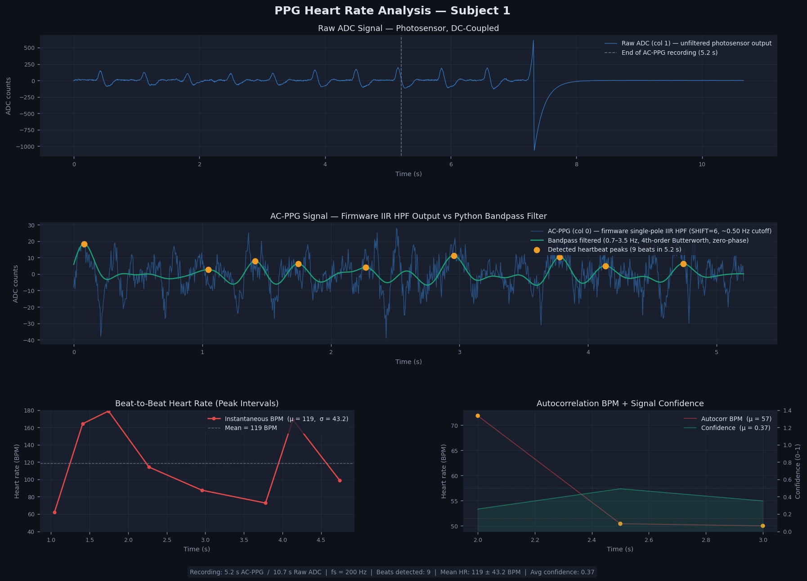
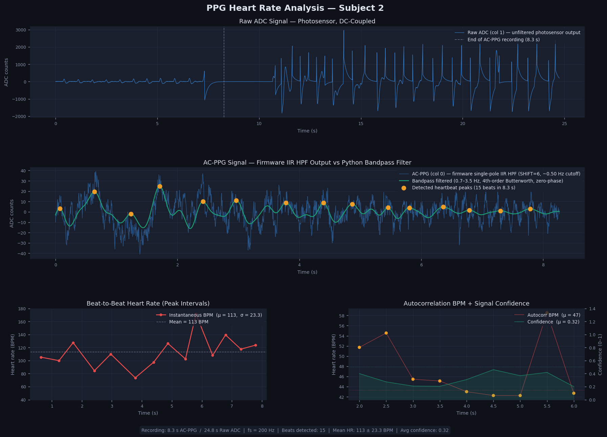

# Heart Rate Monitor

Firmware for a heart rate monitor built on the **nRF52840 DK**, using Nordic nRF Connect SDK (NCS) v3.2.0 / Zephyr RTOS 4.2.x.

The application reads photoplethysmography (PPG) data from the **XD58C** pulse sensor via ADC, applies a DC-offset removal filter, and streams AC samples over UART for host-side heart rate processing.

## Hardware

| Component | Detail |
|-----------|--------|
| SoC | nRF52840 |
| Board | nRF52840 DK (`nrf52840dk/nrf52840`) |
| Sensor | XD58C (PPG / heart rate) |
| Interface | ADC (async) + UART (async TX) |
| Logging | Segger RTT (deferred mode) |

## Repository layout

```
app/            Application entry point and Kconfig/prj.conf
lib/xd58c/      XD58C driver (ADC → DC filter → UART TX)
include/lib/    Public header for the xd58c driver
tests/xd58c/    Unit tests (Zephyr ZTEST / Unity, runs on native_sim)
scripts/        Host-side tools
  ppg_monitor.py      Real-time PPG visualiser and heart rate calculator
  ppg_recordings.ods  Two-subject PPG recording dataset (columns: ac_ppg, raw_adc)
keys/           Signing keys — gitignored, not committed
boards/         Custom board definitions (if any)
dts/bindings/   Custom devicetree bindings
```

## How it works

1. `xd58c_init()` — configures the ADC channel at 200 Hz (5 ms interval), registers an async UART callback, and starts continuous ADC sampling.
2. ADC callback — on each sample, subtracts a running DC estimate (single-pole IIR high-pass, shift = 5) to extract the AC pulse waveform, then enqueues the result.
3. `xd58c_process()` — dequeues one sample and transmits it as a decimal string (`"<value>\r\n"`) over UART0.
4. `main()` calls `xd58c_init()` once, then loops on `xd58c_process()`.

## Prerequisites

- [Docker](https://docs.docker.com/get-docker/) — all build tooling is in the provided `Dockerfile`
- [west](https://docs.zephyrproject.org/latest/develop/west/index.html) — Zephyr meta-tool (installed inside the Docker image)

## Local development setup

Build the Docker image (one-time):

```bash
docker build -t heart-rate-build-env .
```

Start a shell inside the container, mounting the workspace:

```bash
docker run --rm -it \
  -v /path/to/heart-rate-workspace:/workdir \
  heart-rate-build-env
```

Inside the container, initialize the west workspace (one-time):

```bash
cd /workdir/heart-rate-monitor
west init -l .
west update --narrow
```

## Building

```bash
west build -p always \
  -b nrf52840dk/nrf52840 \
  --sysbuild \
  app \
  -- \
  -DSB_CONFIG_BOOT_SIGNATURE_KEY_FILE="/workdir/heart-rate-monitor/keys/heart-rate-ec-p256-dev.pem"
```

- `--sysbuild` builds MCUboot + the application together.
- The signing key path overrides the hardcoded path in `app/sysbuild.conf`.
- Compiled output lands in `build/`.

### Treat warnings as errors (recommended)

Add `-Dapp_CONFIG_COMPILER_WARNINGS_AS_ERRORS=y` to the build command. This is scoped to the app domain only and does not affect MCUboot.

## Flashing

```bash
west flash
```

## Unit tests

Tests live in `tests/xd58c/` and run on the `native_sim` platform — no hardware required.

```bash
west twister \
  -T tests/ \
  --platform native_sim \
  --inline-logs \
  --outdir twister-out/
```

Test results are written to `twister-out/twister.xml` (JUnit format).

### What is tested

| Test | Description |
|------|-------------|
| `test_xd58c_init_success` | Happy path: UART + ADC ready, init returns 0 |
| `test_xd58c_init_no_uart` | UART not ready → returns `-ENODEV` |
| `test_xd58c_init_no_adc` | ADC not ready → returns `-ENODEV` |
| `test_xd58c_init_adc_setup_error` | ADC channel setup fails → returns `-EINVAL` |
| `test_xd58c_uart_write_format` | Sample enqueued and transmitted as `"<value>\r\n"` |

## Host-side monitor script

`scripts/ppg_monitor.py` is a Python GUI that receives the AC samples streamed by the firmware, computes heart rate in real time, and plots the results.

### What it shows

| Panel | Description |
|-------|-------------|
| **PPG Waveform** | 8-second scrolling window — `ac_ppg` trace (blue, α 0.5) overlaid with the 0.7–3.5 Hz bandpass-filtered signal (green); detected beats marked with orange dots |
| **BPM Trend** | Rolling history of up to 30 beat-per-minute estimates plotted as a line graph |
| **BPM Readout** | Large numeric display coloured by confidence: green ≥ 0.50, amber ≥ 0.15, red < 0.15; a bar beneath shows the raw confidence value |

### Algorithm

1. **Bandpass filter** — 4th-order Butterworth, 0.7–3.5 Hz, applied with `filtfilt` (zero phase).
2. **Autocorrelation BPM** — every 0.5 s a 4-second sliding window is autocorrelated; the dominant lag in the 40–180 BPM range gives the estimate and its normalised peak height is used as confidence.
3. **Peak detection** — `scipy.signal.find_peaks` with a minimum inter-peak distance of 60/180 Hz and a prominence threshold of 0.4 σ, used for beat markers only.

### Usage

```bash
# Live mode — connect nRF52840 DK via USB and find the port
python scripts/ppg_monitor.py --port /dev/ttyUSB0 --baud 1000000

# Replay mode — use a saved ODS recording
python scripts/ppg_monitor.py --replay scripts/ppg_recordings.ods

# Replay at 2× speed
python scripts/ppg_monitor.py --replay scripts/ppg_recordings.ods --speed 2
```

### Dependencies

```bash
pip install numpy scipy matplotlib pandas pyserial odfpy openpyxl
```

---

## Recording dataset — `scripts/ppg_recordings.ods`

Two-subject ODS recording captured from the nRF52840 DK + XD58C sensor at 200 Hz.

### Column definitions

| Column | Name | Description |
|--------|------|-------------|
| A | `ac_ppg` | AC-coupled PPG signal — firmware single-pole IIR high-pass filter output (SHIFT = 6, ~0.50 Hz cutoff). This is the signal streamed via UART and used for heart rate calculation. Small amplitude (±40 counts). |
| B | `raw_adc` | Raw ADC photosensor reading — DC-coupled, before any firmware filtering. Large amplitude with slow drift (hundreds of counts). Useful for signal quality assessment. |

### Dataset summary

| Sheet | `ac_ppg` samples | `raw_adc` samples | Duration (AC / Raw) | Detected beats | Mean HR (autocorr) | Mean confidence |
|-------|-----------------|-------------------|---------------------|----------------|-------------------|-----------------|
| `subject-1` | 1 043 | 2 133 | 5.2 s / 10.7 s | 9 | ~57 BPM | 0.37 |
| `subject-2` | 1 654 | 4 950 | 8.3 s / 24.8 s | 15 | ~47 BPM | 0.32 |

### Signal plots

#### Subject 1


#### Subject 2


### Key insights

**Signal pipeline.** The `raw_adc` column shows the DC-biased photosensor output with slow baseline wander (the vertical dashed line marks where the `ac_ppg` recording ends — the Raw ADC logger ran longer). The firmware IIR HPF removes the DC offset, producing the `ac_ppg` column. The Python bandpass filter (0.7–3.5 Hz) then narrows the cardiac band and removes residual low-frequency drift, yielding clean beat peaks for detection.

**Heart rate estimates.** The autocorrelation method consistently estimates ~47–57 BPM across both subjects — a plausible resting heart rate. Beat-to-beat interval counting from peak detection gives higher raw numbers (~113–118 BPM) because the dicrotic notch (secondary pressure wave after the main systolic peak) is sometimes detected as a second beat. The autocorrelation approach is more robust to this artefact.

**Confidence.** Mean confidence scores of 0.32–0.37 (moderate) reflect the short recording windows (5–8 s). Confidence is expected to improve beyond 0.50 once the autocorrelation window accumulates ≥ 10 cardiac cycles (~10 s at 60 BPM). Green dots in the autocorrelation panel mark windows where confidence ≥ 0.50; amber where ≥ 0.15.

**Subject 2 has a lower baseline drift** in `raw_adc` (std = 454 vs 107 for subject 1), suggesting more finger motion or a looser sensor contact during that session. The `ac_ppg` amplitude is comparable between subjects (std ≈ 10–12 counts), confirming the firmware HPF successfully removes the DC component regardless.

## CI

GitHub Actions runs on every pull request and push to `main`.

| Job | What it does |
|-----|--------------|
| `docker` | Builds and pushes the build-env image to GHCR (layer-cached) |
| `build-and-test` | Runs inside the build-env container: initializes the west workspace (cached), builds firmware with warnings-as-errors, runs Twister unit tests, uploads `artifacts/` |

The signing key (`MCUBOOT_SIGNING_KEY_PEM`) must be set as a GitHub repository secret.

## Signing keys

Development keys live in `keys/` (gitignored). Generate a new EC P-256 key pair:

```bash
python3 $ZEPHYR_BASE/../bootloader/mcuboot/scripts/imgtool.py keygen \
  -k keys/heart-rate-ec-p256-dev.pem \
  -t ecdsa-p256
```

## License

Apache-2.0
